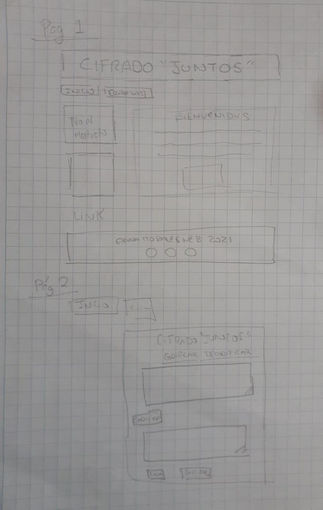
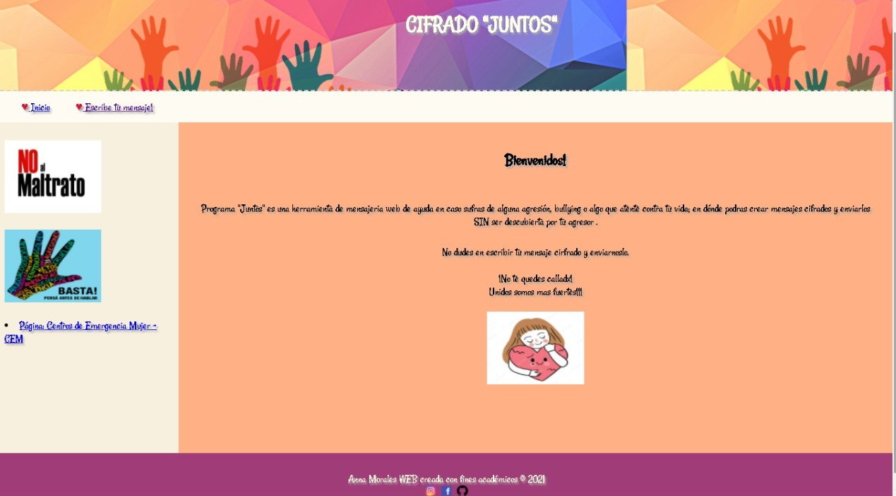

# Cifrado "JUNTOS"

## Índice

* [1. INTRODUCCION](#1-introduccion)
* [2. Resumen del proyecto](#2-resumen-del-proyecto)
* [3. Características del Proyecto](#3-caracteristicas-del-proyecto)
* [4. Funcionalidad del Proyecto](#4-funcionalidad-del-proyecto)
* [5. Prototipos](#5-prototipos)
* [6. Diseño](#6-diseño)
* [7. Interfaz de Usuario](#7-interfaz-de-usuario)

***

## 1. Introducción

El cifrado césar es una de las técnicas más simples para cifrar un mensaje. Es
un tipo de cifrado por sustitución, es decir que cada letra del texto original
es reemplazada por otra que se encuentra un número fijo de posiciones
(desplazamiento) más adelante en el mismo alfabeto.

## 2. Resumen del proyecto

¿A quienes está dirigido el proyecto?

Este proyecto está dirigido para aquellas personas que son agredidas fisica y/o verbalmente; es decir que sufren de algun abuso por parte de alguien, no pueden defenderse y tienen miedo de decirlo porque su agresor se puede enterar. 

¿Cuáles son los objetivos de estos usuarios en relación con tu producto?
Los objetivos de estos usuarios en relación a Cifrado Juntos son que les va permitir escribir algun mensaje de ayudamedio de un cifrado sin que nadie tenga conocimiento de lo que éste dice solamente esa persona y la persona a quien le enviará el mensaje de ayuda. 

## 3. Características del Proyecto

El proyecto utiliza el método de cifrado César, es un tipo de cifrado por sustitución, es decir que cada letra del texto original es reemplazada por otra que se encuentra un número fijo de posiciones (desplazamiento) más adelante en el mismo alfabeto. Acepta las letras mayúsculas y minúsculas, así como los espacios que van entre ellas.

## 4. Funcionalidad del Proyecto

  Para su correcto funcionamiento esta aplicación web requiere de los siguientes datos:

   1.-Texto que se desee cifrar o descifrar
   2.-Número (offset) el cual permite el desplazamiento de los caracteres
   *Al ingresar estos datos en los campos indicados la aplicación procederá a cifrar o descifrar el código de entrega secreto.
   3.- El mensaje cifrado o descifrado podra ser copiado.

## 5. Prototipos
    
   Inicial

   

    
   

     
   Final

  

    
   

     

## 6. Diseño

   Se insertaron 2 pantallas una de inicio y otra de Cifrado.
   Se inserto un link que vincula con la pagina de violencia del gobierno.
   Se opto por implementar una interfaz fácil de usar, presentando un diseño amigable y sencillo.

## 7. Interfaz de Usuario

   La interfaz permite al usuario:

* Elegir un desplazamiento (_offset_) indicando cuántas posiciones queremos que
  el cifrado desplace cada caracter.
* Insertar un mensaje (texto) que queremos cifrar.
* Ver el resultado del mensaje cifrado.
* Insertar un mensaje (texto) a descifrar.
* Ver el resultado del mensaje descifrado.
* Contamos con un botón que permite borrar los datos ingresados para poder cifrar o descifrar más textos.
* Contamos con un botón que permite copiar los datos cifrados o descrifrados.
* Por último podemos apreciar la sección del pie de página donde se encuentra datos sobre la persona que elaboro la pagina y las redes sociales de la para poder ubicarla.